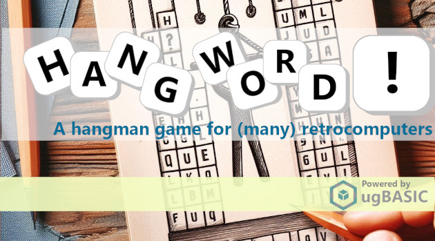

# HANGWORD!
Hangword! - An hangman game for (many) retrocomputers

****

**[Hangword!](https://spotlessmind1975.itch.io/hangword)** is the electronic version of a guessing game for one player. The computer choose a word and the player tries to guess it by suggesting letters within seven (7) guesses. The game contains **a vocabulary of 2.048 words** (both Italian and English), and the repository contains more vocabularies that could be alternatively used, if recompiled. Rules and instructions can be found [here](/docs/game-rules.md).

This game is participating in the [Retro Programming Inside Challenge](https://www.facebook.com/groups/RetroProgrammersInside/posts/1181708413163015/). The game has been written by Marco Spedaletti in [ugBASIC](https://ugbasic.iwashere.eu). It was developed starting from just **one single source code**, and it supports many ugBASIC's targets.

[Click here](https://spotlessmind1975.itch.io/hangword) to download the executables for the various home computers:
  * **AMSTRAD CPC 664** [DSK format] ([more info](docs/instructions-cpc.md))
  * **ATARI 400/800** [XEX or ATR format] ([more info](docs/instructions-atari.md))
  * **ATARI XL/XEGS** [XEX or ATR format] ([more info](docs/instructions-atarixl.md))
  * **COMMODORE 128** [PRG and D64 format] ([more info](docs/instructions-c128.md))
  * **COMMODORE 64** [PRG and D64 format] ([more info](docs/instructions-c64.md))
  * **DRAGON 32** [BIN format] ([more info](docs/instructions-d32.md))
  * **DRAGON 64** [BIN format] ([more info](docs/instructions-d64.md))
  * **MSX** [ROM format] ([more info](docs/instructions-msx1.md))
  * **OLIVETTI PRODEST PC128** [K7 format] ([more info](docs/instructions-pc128op.md))
  * **TRS-80 COLOR COMPUTER 1/2** [BIN and DSK format] ([more info](docs/instructions-coco.md))
  * **TRS-80 COLOR COMPUTER 3** [BIN format] ([more info](docs/instructions-coco3.md))
  * **THOMSON TO8** [K7 format] ([more info](docs/instructions-to8.md))

In addition to downloading the already compiled binaries, it is obviously possible to recompile the game using **[ugBASIC](https://ugbasic.iwashere.eu)** or directly the **[UGBASIC-IDE](https://spotlessmind1975.itch.io/ugbasic-ide)**. The game can currently be compiled with the **[beta](https://ugbasic.iwashere.eu/changelog/beta)** version of the compiler.

For those wishing to deepen the details of its implementation, please refer to there pages:

  * [source code](hangword.bas).
  * [compression algorithm (MSC2)](/docs/compression.md).

## LICENSE

Official binary distribution of **Hangword!** at:
https://spotlessmind1975.itch.io/hangword

**Hangword!** is licensed under the Apache License, Version 2.0 (the "License");
you may not use this file except in compliance with the License.
You may obtain a copy of the License at

http://www.apache.org/licenses/LICENSE-2.0

Unless required by applicable law or agreed to in writing, software distributed under the License is distributed on an "AS IS" BASIS, WITHOUT WARRANTIES OR CONDITIONS OF ANY KIND, either express or implied. See the License for the specific language governing permissions and limitations under the License.
