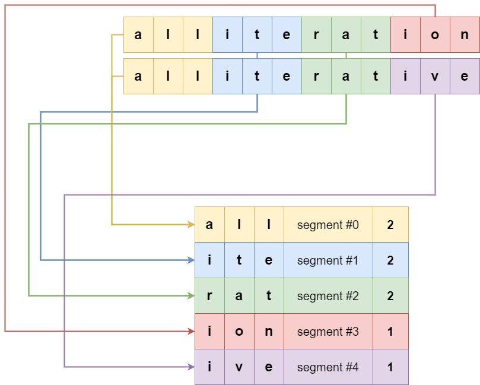

# COMPRESSION ALGORITHM

## DESCRIPTION

Text compression algorithms allow to reduce the size of text without losing any information. In practice, they "squeeze" the data, eliminating redundancies and unnecessary information, without altering the original content. This is especially useful when dealing with limited storage space, like in 8-bit home computers. 

The game implement a very specialized and high performance text compressor (called **MSC2**, in short -- **MSC1** is documented [here](https://retroprogramming.iwashere.eu/msc1)). 

It is based on the following principles:

 * **Segment accounting**: **MSC2** scans the entire dictionary of words to count how much sequences of fixed length characters (called "segments") are present;
 * **Feature extraction**: **MSC2** selects the most frequent segments used, and assign them an unique identification (called "feature");
 * **Redundancy identification**: **MSC2** calculate the minimum number of features necessary to encode a given dictionary of words, whose size is a multiple of "segment";
 * **Feature compression**: **MSC2** will compress each feature, one by one;
 * **Word encoding**: **MSC2** encodes each word using the feature identifications;
 * **Encoding compression**: the overall encoding is compressed again.
 
In the course of this explanation, each point will be explained separately. 

It is important to point out that the compressor and the decompressor work on very different way, and the need to implement a decompressor with limited processing power on 8-bit processors required the adoption of some specific techniques available on [ugBASIC](https://ugbasic.iwashere.eu), which are beyond the scope of this explanation.

Moreover, this page explains only the general format, not how the compressor nor decompressor actually work. The correctness of the decompressor should not depend on implementation details of the compressor, and vice versa.

### SEGMENTS ACCOUNTING

One of the constraints of **Hangword!** game is that the words must always be all of the same length, so that the game is fair and the victories are comparable. 

It follows that it is possible to take a standard dictionary of words and extract only those that satisfy the criterion of having a specific length.

The length of the word, being freely selectable, can be chosen as a multiple of another arbitrary length. For example, if one chooses words of 12 letters, one can choose a base length of 3 letters and represent a word as 4 "segments", one next to the other.

It follows that, given the overall set of words to be encoded, it is possible to identify all the 3-letter segments present, and take into account how many times they are used.

### FEATURE EXTRACTION

Starting from the set of segments, and the related statistical data, it is possible to "put them in order" from the most frequent to the least frequent. 

The rationale behind this choice is simple: the more frequent a segment is, the greater the probability that it will be used to compose a word. The above diagram shows the distribution of features across a vocabulary of 35,601 12-letter words, and 3-letter segments.

In this diagram we show the distribution of the top 32 features, by frequency.

### REDUNDANCY IDENTIFICATION

In this step, the aim is to reduce the space occupied by the statistical analysis of the previous step, in order to occupy the minimum necessary to encode the words of interest. This step is based on the fact of extracting a (contiguous) part of the dictionary, which we can use as "input data", and then calculating all the features of this "subdictionary" taking only a limited set of most frequent features (e.g. 128).

At this point, we recalculate how many "candidate" words can be encoded using a limited number of features, i.e. only 128 features. If the size is satisfactory, the analysis is considered finished and candidate dictionary is effective dictionary to use. Otherwise, the process is repeated by increasing the size of the set of features, until the above criterion is satisfied.

Note that the set of words to be encoded ("candidate dictionary") does not coincide with the set of words analyzed ("target dictionary"), or with the "source dictionary". This allows us to perform a differentiated analysis on part of the dictionary, thus obtaining optimal compressions with different contents, starting from the same starting dictionary.

### FEATURE COMPRESSION

Depending on the size of a single segment, it is possible to perform a specific compression scheme, which depends a lot on the application context. It is not necessary to stick to a specific encoding, but it is necessary that the compressor and the decompressor "agree" in choosing the same one.

In the case of this game, a segment of 3 characters is used at a time. Since they are characters that belong exclusively to the alphabet of natural language, only 26 different values ​​are possible. These values ​​can be encoded with only 5 bits. Therefore, for every 3 characters of the segment, 3 * 5 = 15 bits will be needed, which can be stored in 16 bits (2 bytes).

This step induces a compression of about 2 / 3 = 66% of the original space needed to store the features. If the reduction of the number of features to be counted is applied, for example if only 100 features are needed out of the 256 possible, the saving will be 26% of the needed space occupied.

### WORDS ENCODING
 
 At this point the actual encoding of the words can begin. The encoding assumes that for each (3-character) segment, the corresponding feature index can be used. 

 The algorithm is quite simple: **MSC2** take each word and, for each segment of a word, it identifies the feature among those available and replace that segment with the feature number. The result will be a sequence of a certain number of features for each word. From the previous step, we know that all words can always be traced back to one of the segments. Therefore, only the feature indices must be represented. No escape sequence is needed.

In this specific implementation, 3 characters are replaced with a single byte, and a 12-character word is encoded with 4 bytes, with a net saving of 66%.

### ENCODING COMPRESSION 

 

In order to optimize the storage of the encoded words, an additional technique is used. It tries to represent, in a compact way, the encoding result of the previous step. In order to do this, the words are ordered according to the same sequences of features. 

 

At this point, instead of representing the various words linearly, the (first) common feature and the number of words that share it are indicated. The process is then repeated with the second feature. The following are represented sequentially.

It follows that 10 words that share the first three features, instead of occupying 40 bytes (4 bytes * 10 words) occupy only 2 + 2 + 2 * 10 = 24. A saving of at least 40%.

# EXAMPLES

## English language

All dictionaries have 2048 9-letter words:

| **Dictionary** | **Uncompressed** | **Compressed** | **Ratio** |
| -------- | ------- | ------- | ------- |
| [ENGLISH nr. 1](./words_english_001.md) |       18.432 |      5.028 | ~73% (~27% of original size) |
| [ENGLISH nr. 2](./words_english_002.md) |       18.432 |      5.042 | ~73% (~27% of original size) |
| [ENGLISH nr. 3](./words_english_003.md) |       18.432 |      5.042 | ~73% (~27% of original size) |

For more info:

 * **ENGLISH nr. 1** (2048 9-letter words) : [dictionary](./words_english_001.md) [source code](../resources/words_english_001.bas)
 * **ENGLISH nr. 2** (2048 9-letter words) : [dictionary](./words_english_002.md) [source code](../resources/words_english_002.bas)
 * **ENGLISH nr. 3** (2048 9-letter words) : [dictionary](./words_english_003.md) [source code](../resources/words_english_003.bas)
 
## Italian language

All dictionaries have 2048 12-letter words:

| **Dictionary** | **Uncompressed** | **Compressed** | **Ratio** |
| -------- | ------- | ------- | ------- |
| [ITALIANO nr. 1](./words_italian_001.md) |       24.576 |      4.946 | ~80% (~20% of original size) |
| [ITALIANO nr. 2](./words_italian_002.md) |       24.576 |      5.032 | ~80% (~20% of original size) |
| [ITALIANO nr. 3](./words_italian_003.md) |       24.576 |      4.890 | ~80% (~20% of original size) |

For more info:

 * **ITALIANO nr. 1** (2048 12-letter words) : [dictionary](./words_italian_001.md) [source code](../resources/words_italian_001.bas)
 * **ITALIANO nr. 2** (2048 12-letter words) : [dictionary](./words_italian_002.md) [source code](../resources/words_italian_002.bas)
 * **ITALIANO nr. 3** (2048 12-letter words) : [dictionary](./words_italian_003.md) [source code](../resources/words_italian_003.bas)

 