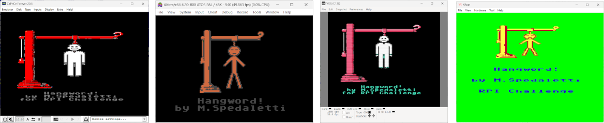
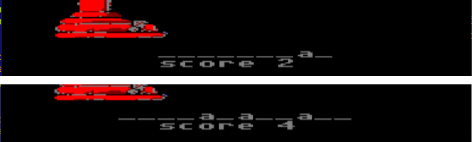
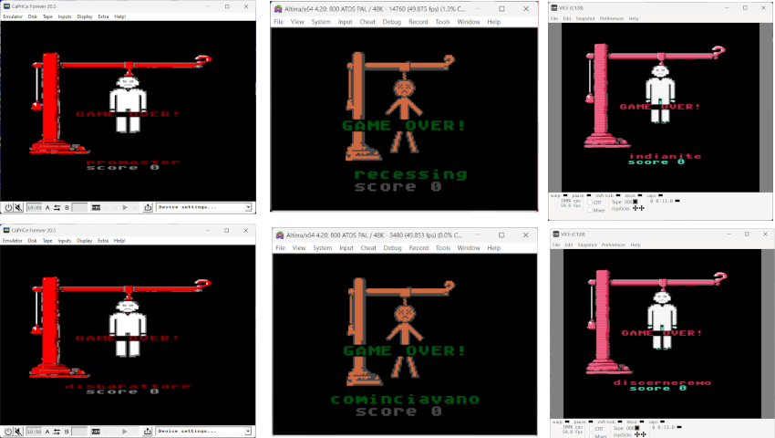

# GAME RULES AND INSTRUCTIONS

## STARTING THE GAME

As soon as the game is loaded, you can start the game by pressing a button.

 The game starts with a random choice of a word from those stored in the game. There are **2048 words** in the dictionary (English dictionary is [here](./words_english_001.md), Italian dictionary is [here](./words_italian_001.md)), so the probability of the same word being selected is 1/2048 (about 0.05%). This ensures a decent longevity to the game.

## ACHIEVING THE GOAL

The aim of the game is to guess the word chosen by the computer within a limit of 7 attempts. For each failed guess, an additional element of the hanging man will be drawn. When the man is drawn in its entirely, the game ends.

The word is 9 characters long (in the English version) and 12 characters long (in the Italian version). The different length of the words depends on the different nature of the languages. From the point of view of difficulty, however, they are equivalent. This is because Italian words contain many more repetitions than English words, as it can be verified by studying the [compression algorithm](./compression.md).

## CHOOSING LETTERS

To select a letter to guess, simply press the corresponding key (A...Z). 

If the letter is contained in the secret word chosen, it will appear on the screen. If it is not contained, a short audio sound (*) will be emitted and the hanging man will be slowly drawn. If the letter has already been displayed, the sound will be different, to indicate that you are in this situation.

(*) the sound is available on [Amstrad CPC 664](./instructions-cpc.md), [ATARI 400/800](./instructions-atari.md), [ATARI XL/XEGS](./instructions-atarixl.md), [Commodore 128](./instructions-c128.md), [Commodore 64](./instructions-c64.md).

## RECEIVING A SCORE

The scoring system is linked to the path taken to discover the secret word. Each time a letter is guessed, the player earns a point. After that, each time the letter appears in the word, an additional point is earned. Repeating the insertion of a letter already entered does not entail any advantage, in terms of points, as well as if a letter is incorrect. 

If the word is guessed, 24 points are earned. On the contrary, after 7 wrong attempts, 6 points are lost.
