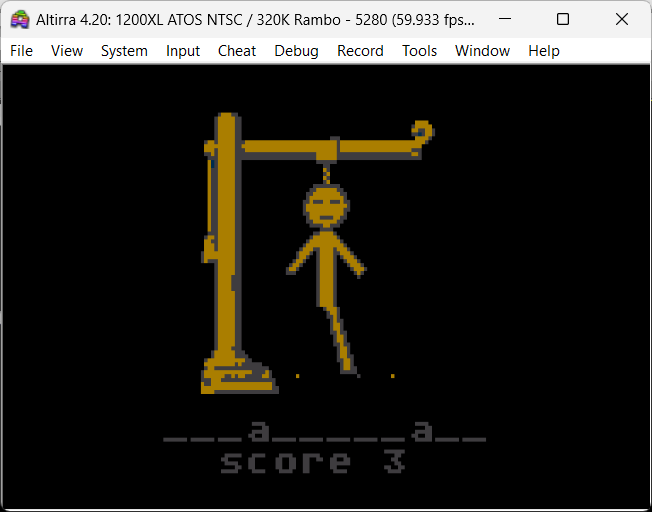

# INSTRUCTIONS

## ATARI XL/XEGS

In order to play this game on an **ATARI XL** or **ATARI XEGS** you need this home computer or to download and install an emulator. The game has been tested with *Altirra version 4.20* .

The emulator can be downloaded [here](https://www.virtualdub.org/altirra.html).

### Loading instructions

Once the emulator software has been installed, follow the instructions below:
 - start **altirra.exe** program;
 - click on **File** > **Boot Image...**
 - select <code>hangword.atarixl.xex</code> / <code>hangword.atarixl.atr</code> file ([click here to download](https://spotlessmind1975.itch.io/hangword));
 - click on **Open**.

Alternatively, you can directly perform the command line game, indicating the file as a parameter of the emulator:
 - type <code>altirra /defprofile:xl hangword.atarixl.xex</code>
 - type <code>altirra /defprofile:xl hangword.atarixl.atr</code>

